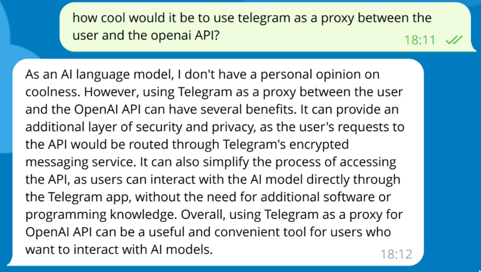

# OpenAI Wrapper Telegram Bot (serverless @ Cloudflare)



## Features
* You can send a message to the telegram bot and it will act as a proxy between you and the openAI API.
* User management is included so that unknown users won't have access. The user-management requires Cloudflare KV.

## Requirements
* Either have `node` version **18.12.0** or have `nvm` installed so it can manage your version

## Installation
```
git clone git@github.com:realestninja/serverless-telegram-bot-openai-wrapper.git
cd serverless-telegram-bot-openai-wrapper
nvm use
yarn install
```

Rename the example files and add all the required tokens to `.dev.vars` and `wrangler.toml`.
You require a Cloudflare Worker KV to handle user management.

## Development
`yarn dev`

In dev mode, you can hit `l` to activate local mode.

With this [development-helper](https://github.com/realestninja/serverless-telegram-bot-development-helper) you can forward messages from your bot to the local instance of this boilerplate. (Check for correct ports)

## Deployment
`yarn deploy`, then follow the steps presented by Wrangler. After deployment, you should have received the url where the bot is hosted. This will be used for setting up the webhook.

## Set up the webhook
Lastly you need to set up the webhook.

Replace the sections in this url (bot token & webhook), then call it and your bot should be set up.

```https://api.telegram.org/bot<bot token>/setWebhook?url=<worker url>```
